# NeoFaker: Arsitektur dan Cara Kerja

| | |
| --- | --- |
| **Versi** | 0.16.0 |
| **Status** | Berlaku untuk branch `refactor` (commit setelah `808f492`) |
| **Pembaca** | Maintainer. Ini catatan internal, bukan dokumentasi pengguna |
| **Dokumentasi pengguna** | `lib/pages/**` (dipublikasikan ke HexDocs) |

Catatan ini menjelaskan *kenapa* NeoFaker disusun seperti sekarang dan *apa yang terjadi di balik layar*
ketika satu fungsi seperti `NeoFaker.Person.first_name(locale: :id_id)` dipanggil. Urutannya dari gambaran
besar ke detail: baca bagian 1 sampai 4 untuk model mental, lalu lompat ke bagian yang relevan saat butuh.

## Daftar isi

1. [Ringkasan](#1-ringkasan)
2. [Latar belakang: apa yang diperbaiki v0.16.0](#2-latar-belakang-apa-yang-diperbaiki-v0160)
3. [Gambaran besar](#3-gambaran-besar)
4. [Anatomi satu panggilan](#4-anatomi-satu-panggilan)
5. [Lapisan publik: modul domain](#5-lapisan-publik-modul-domain)
6. [Lapisan locale](#6-lapisan-locale)
7. [Lapisan data](#7-lapisan-data)
8. [Validasi dan kontrak error](#8-validasi-dan-kontrak-error)
9. [Randomness dan seeding](#9-randomness-dan-seeding)
10. [Deep dive per generator](#10-deep-dive-per-generator)
11. [Pipeline dokumentasi](#11-pipeline-dokumentasi)
12. [Testing dan CI](#12-testing-dan-ci)
13. [Keputusan desain dan trade-off](#13-keputusan-desain-dan-trade-off)
14. [Batasan yang diketahui](#14-batasan-yang-diketahui)
15. [Resep: menambah fitur](#15-resep-menambah-fitur)
16. [Peta file](#16-peta-file)
17. [Glosarium](#17-glosarium)

---

## 1. Ringkasan

NeoFaker adalah library Elixir untuk membuat data palsu yang realistis (nama, email, tanggal, UUID, dan
sebagainya) untuk test, seed database, dan development. Seluruh library adalah **fungsi murni tanpa proses**:
tidak ada GenServer, tidak ada supervision tree, tidak ada state global yang bisa berubah. Satu-satunya "state"
adalah:

1. **Cache data** di `:persistent_term`, yang diisi sekali lalu hanya dibaca.
2. **Locale per proses** di process dictionary, yang hanya dilihat oleh proses itu sendiri.
3. **State `:rand` per proses**, yang dikelola VM.

Arsitekturnya tiga lapis:

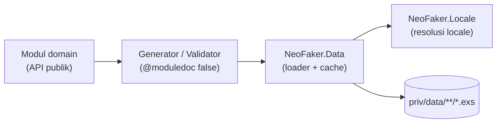

Tiga prinsip yang dipegang di seluruh kode:

- **Validasi di pintu masuk.** Setiap argumen divalidasi di fungsi publik, sebelum menyentuh logika acak.
- **Semua keacakan lewat `:rand`.** Karena itu `NeoFaker.seed/1` bisa membuat output reproducible. Satu-satunya
  pengecualian yang disengaja adalah `NeoFaker.Crypto.token/2`.
- **Data dibaca sekali.** File `.exs` di-eval sekali per locale, lalu setiap panggilan berikutnya hanya
  membaca dari `:persistent_term`.

---

## 2. Latar belakang: apa yang diperbaiki v0.16.0

Bagian ini ditulis dengan gaya PRD: masalah, tujuan, dan batasan ruang lingkup.

### 2.1 Masalah

Audit menyeluruh terhadap v0.15.0 menemukan bug yang **mengubah output tanpa error**. Ini kategori bug paling
berbahaya untuk library data palsu, karena test tetap hijau sementara datanya salah. Contoh paling penting:

| Area | Gejala di v0.15.0 | Akar masalah |
| --- | --- | --- |
| `Internet.ipv4/1` | Tidak pernah menghasilkan `170.x.x.x` dan `171.x.x.x` | Dua blok hilang dari tabel bobot oktet pertama |
| Opsi `locale:` | `locale: :id` (typo) diam-diam menghasilkan data Inggris | Locale tidak divalidasi; fallback per file menutupi typo |
| `NeoFaker.Data` | Atom locale buatan bisa menunjuk file di luar `priv/data` lalu di-`eval` | Segmen locale di path tidak divalidasi |
| `Color.random/1` | Selalu raise untuk format selain `:w3c` | Opsi diteruskan ke fungsi yang skemanya berbeda |
| `Color.keyword(category: :all)` | 15 warna dasar muncul 2x lebih sering | `Map.values \|> List.flatten` menghitung duplikat lintas kategori |
| `Gravatar.display/2` | Email `"sampah a@b.com"` diterima; URL fallback merusak query | Regex tidak di-anchor; parameter tidak di-encode |
| `Time.between/2` | Bisa melewati batas `finish` sub-detik | Offset dihitung dalam detik, ditambahkan ke waktu bermikrodetik |
| `full_name_with_title/1` | "Mr. Jane Doe" | Prefix tidak tahu jenis kelamin nama |
| SSN | Area `777` 2x lebih sering | `666` diganti `777` alih-alih diundi ulang |
| NIK | Kode wilayah kebanyakan tidak nyata (provinsi `20`) | Digabung dari rentang sembarang |
| `Lorem` | Sekitar 0,5 ms per kata | Seluruh teks di-regex ulang di setiap panggilan |

### 2.2 Tujuan

- **G1. Tidak ada output salah yang diam.** Input tidak valid harus raise dengan pesan yang menyebut nilainya.
- **G2. Distribusi yang jujur.** Setiap nilai di pool punya peluang yang sama, kecuali dokumentasi menyatakan lain.
- **G3. Reproducible.** Setelah `NeoFaker.seed/1`, urutan output identik di setiap run.
- **G4. Murah per panggilan.** Tidak ada I/O atau parsing berulang di jalur panas.
- **G5. Dokumentasi tidak bisa basi.** Contoh di cheatsheet berasal dari `@doc`, dan CI memeriksanya.

### 2.3 Non-goals

- **Keunikan.** NeoFaker menjamin realisme, bukan keunikan. Untuk nilai unik, pakai `System.unique_integer/1`
  dan constraint database.
- **Distribusi dunia nyata.** Golongan darah, nama, dan kota diundi seragam, bukan mengikuti frekuensi populasi.
- **Keamanan kriptografis.** Hash dan UUID tidak untuk rahasia sungguhan. Hanya `Crypto.token/2` yang memakai
  `:crypto.strong_rand_bytes/1`.

### 2.4 Ukuran keberhasilan

| Metrik | v0.15.0 | v0.16.0 |
| --- | --- | --- |
| Jumlah test | 537 | 565 |
| Test coverage | 100% | 100% |
| `mix credo --strict` | Bersih | Bersih |
| Warning `mix docs` | Ada (dari changelog) | 0 |
| `Lorem.words(1000)` | Sekitar 562 ms | Sekitar 14 ms |

---

## 3. Gambaran besar

### 3.1 Peta modul

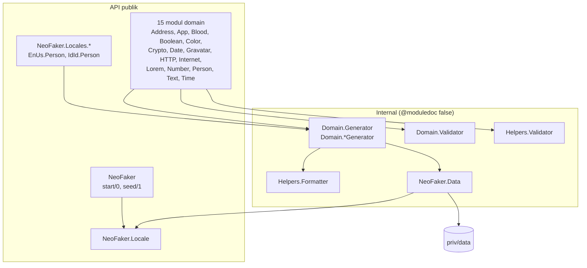

Aturan dependensi:

- **Satu arah.** Domain → Generator → Data → Locale. `Locale` tidak pernah memanggil `Data`.
- **Tidak ada `import` antar modul proyek.** Selalu `alias` dan panggil dengan prefix, supaya asal fungsi jelas
  di titik panggil. `import Bitwise` (makro stdlib) boleh.
- **Generator boleh memanggil modul domain lain** kalau memang butuh hasilnya, misalnya
  `Internet.UsernameGenerator` memanggil `NeoFaker.Person.first_name/0`.

### 3.2 Pembagian kerja per lapisan

| Lapisan | Tanggung jawab | Tidak boleh |
| --- | --- | --- |
| Modul domain | `@doc`, `@spec`, validasi opsi (NimbleOptions) dan argumen posisional, merakit hasil | Berisi logika acak yang panjang |
| `Generator` | Logika acak murni | Memvalidasi input dari pengguna |
| `Validator` | Pengecekan khusus domain | Menghasilkan nilai acak |
| `Helpers.*` | Pengecekan dan pembentukan string yang dipakai beberapa domain | Mengetahui domain tertentu |
| `Data` | Membaca, meng-cache, dan mengundi data file | Mengetahui arti isi data |
| `Locale` | Menentukan locale aktif dan memvalidasi kode locale | Membaca file |

---

## 4. Anatomi satu panggilan

Ikuti `NeoFaker.Person.first_name(locale: :id_id)` dari awal sampai akhir.

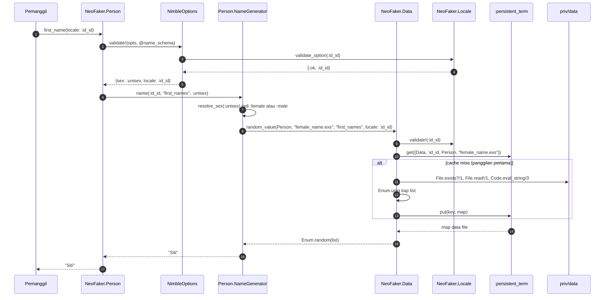

Hal yang perlu diperhatikan:

- **Validasi locale terjadi dua kali**, di NimbleOptions (langkah 3) dan di `Data` (langkah 9). Yang pertama
  memberi error ramah pengguna (`NimbleOptions.ValidationError`). Yang kedua adalah jaring pengaman, karena
  `Data` juga dipanggil generator internal dengan locale hardcode, dan locale itu masuk ke path file.
- **Setelah panggilan pertama**, langkah 11 sampai 13 dilewati. Jalur panas hanya berisi validasi opsi, satu
  lookup `:persistent_term` (langkah 10), dan satu `Enum.random/1`.
- **`:unisex` di-resolve sekali** sebelum mengundi, jadi satu nama lengkap tidak pernah mencampur daftar
  perempuan dan laki-laki (lihat [10.4](#104-person-jenis-kelamin-dan-prefix)).

---

## 5. Lapisan publik: modul domain

### 5.1 Bentuk standar sebuah fungsi

Hampir semua fungsi publik mengikuti pola yang sama:

```elixir
@name_schema NimbleOptions.new!(
               sex: [type: {:in, [:unisex, :male, :female]}, default: :unisex],
               locale: [type: {:custom, Locale, :validate_option, []}, default: nil]
             )

def first_name(opts \\ []) do
  opts = NimbleOptions.validate!(opts, @name_schema)
  NameGenerator.name(Keyword.fetch!(opts, :locale), "first_names", Keyword.fetch!(opts, :sex))
end
```

Kenapa begini:

- **Skema dikompilasi sekali** dengan `NimbleOptions.new!/1` di module attribute, bukan setiap panggilan.
- **`Keyword.fetch!/2`, bukan `opts[:key]`.** Setelah validasi, setiap key pasti ada karena punya default.
  `fetch!` mendokumentasikan asumsi itu dan crash keras kalau asumsinya salah.
- **Default dari skema divalidasi juga.** NimbleOptions menjalankan validator custom terhadap nilai default.
  Karena itu default `locale: nil` harus diterima `Locale.validate_option/1`.

### 5.2 Meneruskan opsi ke fungsi lain

Fungsi komposit seperti `Internet.email/1` menerima opsi milik beberapa fungsi. NimbleOptions menolak key yang
tidak dideklarasikan, jadi opsi tidak bisa diteruskan mentah-mentah:

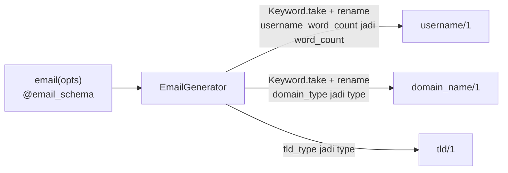

Aturannya: ambil subset dengan `Keyword.take/2`, ganti nama key yang di-prefix, lalu panggil fungsi publik
tujuan, yang akan memvalidasi ulang dengan skemanya sendiri.

### 5.3 Modul locale-exclusive

Format yang hanya ada di satu negara, seperti SSN atau NIK, tidak dijadikan opsi `locale:` di fungsi bersama
karena tidak punya padanan untuk fallback. Modul-modul ini tinggal di `NeoFaker.Locales.<Kode>.*`. Aturannya:

- **Tidak bergantung pada locale aktif.** Kalau butuh data, panggil `Data` dengan `locale:` eksplisit.
- **Prefix namespace penting.** `groups_for_modules/0` di `mix.exs` memisahkan sidebar ExDoc dengan mencocokkan
  prefix literal `NeoFaker.Locales.`.

---

## 6. Lapisan locale

### 6.1 Urutan resolusi

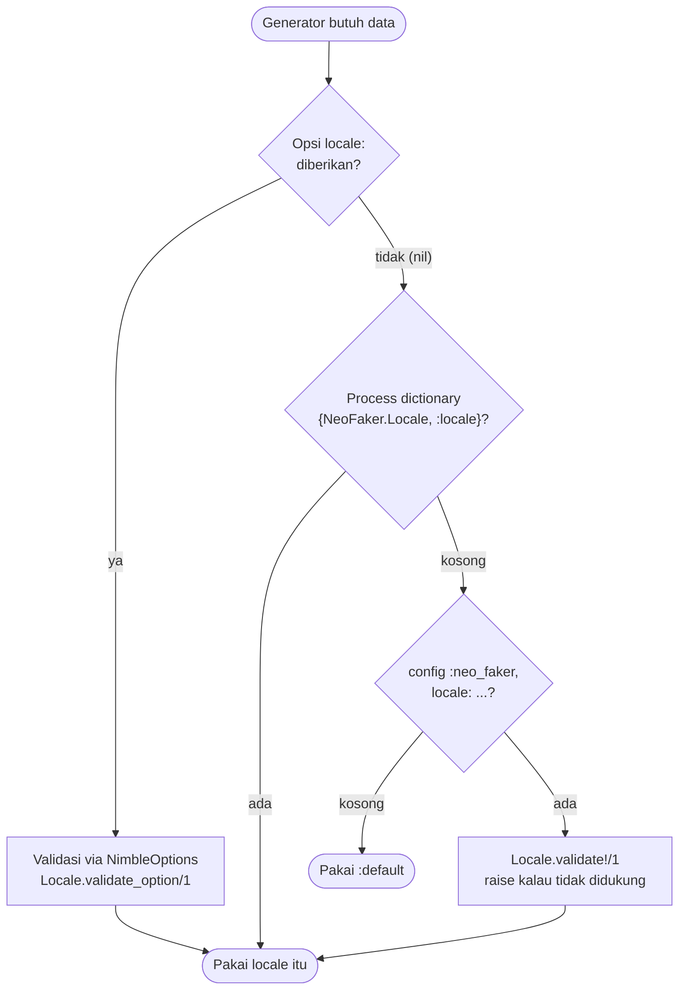

| Lapisan | Disetel dengan | Cakupan | Tervalidasi saat |
| --- | --- | --- | --- |
| Per panggilan | `locale: :id_id` | Satu panggilan | Validasi opsi |
| Per proses | `NeoFaker.Locale.set/1` | Proses pemanggil | `set/1` dipanggil |
| Per aplikasi | `config :neo_faker, locale: ...` | Seluruh node | Setiap dibaca (`fetch/0`) |
| Bawaan | Tidak ada | Semua | Tidak perlu |

### 6.2 Kenapa process dictionary

Sebelum v0.15.0, `set_locale/1` menulis ke `Application.put_env/3`, yang global untuk seluruh node. Dua test
`async: true` yang memakai locale berbeda saling menimpa. Process dictionary menyelesaikan ini karena setiap
proses ExUnit punya dictionary sendiri.

Konsekuensinya perlu diingat: **proses anak tidak mewarisi locale.** `Task.async/1` yang dipanggil setelah
`Locale.set(:id_id)` tetap memakai config aplikasi atau `:default`. Untuk kasus itu, teruskan opsi `locale:`.

### 6.3 `:default` bukan locale

`:default` adalah nama data set dasar di `priv/data/default/` (bahasa Inggris AS). Ia sengaja tidak ada di
`@supported_locales`:

- `Locale.supported/0` mengembalikan `[:en_us, :id_id]`.
- `Locale.available?(:default)` mengembalikan `false`.
- Tetapi `set(:default)` dan `locale: :default` tetap diterima.

`:en_us` saat ini tidak punya file sama sekali, jadi semuanya jatuh ke `:default`. Keberadaannya sebagai kode
terpisah memberi ruang untuk data khusus AS kelak tanpa mengubah API.

### 6.4 Dua fungsi validasi

| Fungsi | Dipakai oleh | Hasil untuk locale buruk |
| --- | --- | --- |
| `Locale.validate!/1` | `set/1`, config aplikasi, `Data` | `ArgumentError` |
| `Locale.validate_option/1` | Skema NimbleOptions (opsi `locale:`) | `{:error, msg}`, dibungkus jadi `NimbleOptions.ValidationError` |

Keduanya `@doc false`: publik agar bisa dipanggil lintas modul, tapi bukan API pengguna.

---

## 7. Lapisan data

### 7.1 Struktur direktori

```text
priv/data/
├── default/                 # data dasar, wajib lengkap
│   ├── address/  city.exs, country.exs
│   ├── app/      description.exs, license.exs, name.exs
│   ├── color/    keyword.exs
│   ├── http/     status_code.exs, user_agent.exs
│   ├── internet/ popular_domain.exs, tld.exs
│   ├── lorem/    lorem_ipsum.exs, meditations.exs
│   ├── person/   female_name.exs, male_name.exs, gender.exs, name_affixes.exs
│   ├── text/     emoji.exs, word.exs
│   └── time/     time_zone.exs
└── id_id/                   # hanya file yang benar-benar diterjemahkan
    ├── address/  city.exs, country.exs
    ├── app/      description.exs, name.exs
    ├── color/    keyword.exs
    └── person/   female_name.exs, male_name.exs, gender.exs, name_affixes.exs,
                  region_code.exs  <- khusus NIK (Locales.IdId.Person)
```

Setiap file adalah literal map Elixir biasa: `%{"key" => ["nilai", ...]}`.

### 7.2 Dari modul ke path

Tidak ada konfigurasi pemetaan. Path diturunkan dari nama modul:

```text
Data.random_value(NeoFaker.Person, "female_name.exs", "first_names", locale: :id_id)
                  └─ Module.split |> List.last |> downcase = "person"

priv/data/  id_id  /  person  /  female_name.exs
            locale    modul      file
```

Akibatnya: generator internal seperti `Person.NameGenerator` **harus** mengoper `NeoFaker.Person`, bukan
`__MODULE__`, karena `__MODULE__` akan menjadi direktori `namegenerator/` yang tidak ada. Hal yang sama
membuat `NeoFaker.Locales.IdId.Person` membaca dari `priv/data/id_id/person/`.

Path dibangun dengan `Application.app_dir/2`, bukan relatif terhadap file sumber, supaya tetap benar di dalam
release, di mana `priv/` berada di samping file `.beam`.

### 7.3 Alur load dan cache

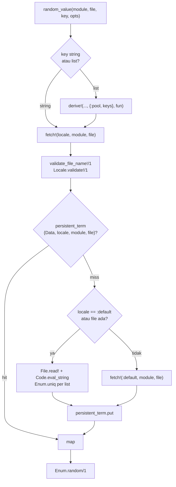

### 7.4 Kunci cache

| Kunci | Nilai | Dibuat oleh |
| --- | --- | --- |
| `{NeoFaker.Data, locale, module, file}` | Map data file (list sudah di-dedup) | `fetch!/3` |
| `{NeoFaker.Data, :derived, locale, module, file, name}` | Hasil `fun.(map)` | `derive!/5` |

`locale` di kunci adalah **locale yang diminta**, bukan locale hasil fallback. Contoh: panggilan pertama
`Text.word(locale: :id_id)` mengecek `File.exists?` sekali (tidak ada), memuat salinan `:default`, lalu
menyimpannya di bawah kunci `:id_id`. Panggilan berikutnya langsung hit. Harganya, data yang sama tersimpan
dua kali (di kunci `:default` dan `:id_id`). Total data hanya ratusan KB, jadi ini ditukar dengan tidak adanya
I/O di jalur panas.

### 7.5 Kenapa `:persistent_term`

| Kebutuhan | `:persistent_term` | ETS | Process state (GenServer) |
| --- | --- | --- | --- |
| Baca tanpa menyalin ke heap proses | Ya | Tidak (menyalin) | Tidak (lewat pesan) |
| Tanpa proses yang harus di-supervise | Ya | Butuh pemilik tabel | Tidak |
| Tahan banyak pembaca bersamaan | Ya, tanpa lock | Ya | Bottleneck satu proses |
| Murah ditulis | **Tidak**, update memicu GC global | Ya | Ya |

Data NeoFaker ditulis sekali lalu dibaca terus, profil yang persis cocok untuk `:persistent_term`. Kelemahannya
(update dan erase memicu global GC) tidak berlaku karena kunci tidak pernah diubah atau dihapus.

**Race saat cache pertama kali terisi aman.** Kalau dua proses miss bersamaan, keduanya memuat file dan memanggil
`put/2` dengan nilai yang sama. Dokumentasi OTP (`persistent_term.erl`, OTP 27) menyatakan: *"If the value
`Value` is equal to the value previously stored for the key, `put/2` will do nothing and return quickly."* Jadi
tidak ada global GC dari race ini. Kerugiannya hanya kerja parsing ganda sekali.

### 7.6 Pool multi-key

Beberapa generator mengundi dari gabungan beberapa kategori, misalnya `Color.keyword(category: :all)`
menggabungkan `"basic"` dan `"extended"`. Cara naif:

```elixir
data |> Map.values() |> List.flatten() |> Enum.random()
```

Ini **bias**: 15 dari 16 warna dasar juga tercantum di `"extended"`, jadi peluangnya dua kali lipat. Solusinya,
`random_value/4` menerima list key:

```elixir
Data.random_value(NeoFaker.Color, "keyword.exs", ["basic", "extended"], locale: locale)
```

`Data` menggabungkan list-list itu, menjalankan `Enum.uniq/1`, lalu menyimpan hasilnya lewat `derive!/5` dengan
nama `{:pool, keys}`. Pool yang sama dipakai untuk emoji `:all`, TLD `:all_except_safe`, domain populer,
user agent, kode status HTTP, gender `:all`, dan prefix nama.

### 7.7 `derive!/5`: cache untuk data olahan

Sebagian generator perlu mengolah data sebelum mengundi. `derive!/5` menjalankan fungsi olahan sekali dan
menyimpan hasilnya:

| Pemakai | Nama | Hasil yang di-cache |
| --- | --- | --- |
| `Data.random_value/4` (list key) | `{:pool, keys}` | List gabungan tanpa duplikat |
| `Lorem.Generator` | `:paragraphs`, `:sentences` | Paragraf dan kalimat hasil split regex |
| `Locales.IdId.Person.Generator` | `:tuple` | 7.285 kode kecamatan sebagai tuple |

Kasus Lorem adalah alasan fitur ini dibuat: sebelumnya setiap `Lorem.word/1` menjalankan regex atas seluruh
teks (puluhan KB). Setelah di-cache, 1000 kata turun dari sekitar 562 ms menjadi 14 ms.

Kasus NIK memakai **tuple**, bukan list, karena `Enum.random/1` pada list harus berjalan sampai elemen ke-n
(O(n)), sedangkan `elem/2` pada tuple O(1). Untuk 7.285 elemen perbedaannya terasa.

### 7.8 Keamanan: kenapa `Code.eval_string/3` aman di sini

Data file dievaluasi sebagai kode Elixir, jadi path yang di-eval harus selalu berada di dalam `priv/data/`.
Ada dua gerbang:

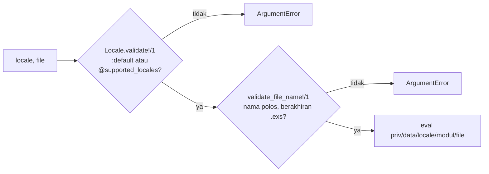

Segmen ketiga (direktori modul) berasal dari nama modul di kode sumber, bukan dari input pengguna. Di v0.15.0
hanya gerbang kedua yang ada, sehingga `locale: :"../../tmp/x"` bisa lolos ke path.

---

## 8. Validasi dan kontrak error

### 8.1 Jenis error

| Situasi | Exception | Contoh |
| --- | --- | --- |
| Opsi keyword salah (key tak dikenal, nilai salah, locale tak didukung) | `NimbleOptions.ValidationError` | `Color.hex(format: :two)` |
| Argumen posisional salah (range, batas, jumlah) | `ArgumentError` | `Lorem.words(0)` |
| Locale tak didukung lewat `Locale.set/1` atau config | `ArgumentError` | `Locale.set(:fr_fr)` |
| Bug internal (data file rusak, key hilang) | `KeyError`, `MatchError`, dan sebagainya | File locale tanpa key wajib |

Pesan error mengikuti konvensi stdlib Elixir: huruf kecil di awal, dan menyebut nilai yang salah,
misalnya `"count must be a positive integer, got: 0"`.

### 8.2 Tiga tempat validasi

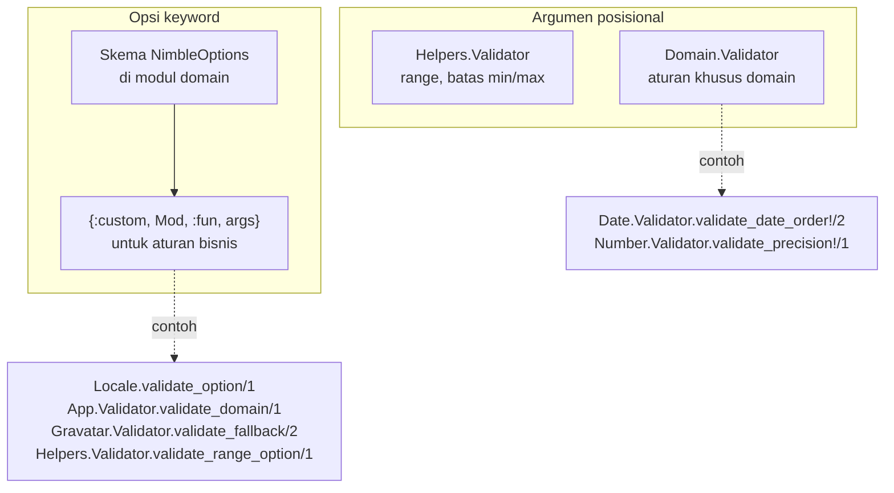

Aturan kapan membuat `Validator` per domain: hanya kalau ada aturan khusus domain. Domain yang cukup memakai
`Helpers.Validator` (Address, Person, Blood, Color, Text) tidak punya modul `Validator` sendiri.

### 8.3 Validasi range: kenapa `Range.size/1`

Versi lama menolak range kalau `first > last`. Aturan itu salah ke dua arah:

| Range | Isi | Aturan lama (`first <= last`) | Aturan baru (`Range.size/1 > 0`) |
| --- | --- | --- | --- |
| `1..10` | 1 sampai 10 | Diterima | Diterima |
| `10..1//-1` | 10 turun ke 1 | **Ditolak** padahal valid | Diterima |
| `1..10//-1` | Kosong | **Diterima**, lalu `Enum.random` raise `Enum.EmptyError` | Ditolak dengan pesan jelas |

`Range.size/1` menghitung jumlah elemen dengan memperhitungkan step, jadi ia menjawab pertanyaan yang
sebenarnya: "apakah ada yang bisa diundi?"

---

## 9. Randomness dan seeding

### 9.1 Satu sumber keacakan

Semua generator memakai `:rand`, langsung (`:rand.uniform/1`, `:rand.bytes/1`) atau lewat `Enum.random/1`,
yang juga memakai `:rand`. State `:rand` disimpan per proses di process dictionary, dan VM memberi seed acak
otomatis saat pertama dipakai.

```elixir
NeoFaker.seed(42)
a = NeoFaker.Person.full_name()
NeoFaker.seed(42)
b = NeoFaker.Person.full_name()
a == b  # true
```

`seed/1` memakai algoritma `:exsss`, default `:rand` sejak OTP 22. Versi 0.15.0 memakai `:exsplus`, jadi urutan
hasil seed berbeda antar versi. Reproducibility dijamin di dalam satu versi, bukan lintas versi.

### 9.2 Pengecualian yang disengaja

| Fungsi | Sumber | Ikut `seed/1`? | Alasan |
| --- | --- | --- | --- |
| `Crypto.md5/1` dan hash lain | `:rand.bytes(16)` lalu `:crypto.hash/2` | Ya | Data palsu, tidak perlu rahasia |
| `Crypto.uuid/1` | `:rand.bytes(16)` | Ya | Sama |
| `Crypto.token/2` | `:crypto.strong_rand_bytes/1` | **Tidak** | Orang mungkin memakainya sebagai token sungguhan |
| `Date.*`, `Time.add/2`, `App.semver(type: :build)` | Tanggal/waktu saat ini + offset acak | Offset ya, titik acuan tidak | "Hari ini" berubah setiap hari |

### 9.3 Undian yang tidak bias

Beberapa perbaikan v0.16.0 adalah soal distribusi, bukan crash:

- **`Boolean.boolean(0)`**: `:rand.uniform() <= 0.0` bisa `true` karena `uniform/0` bisa mengembalikan tepat
  `0.0`. Sekarang memakai integer: `:rand.uniform(100) <= ratio`.
- **Alpha warna**: `Float.round(:rand.uniform(), 1)` memberi `0.0` dan `1.0` setengah peluang nilai lain
  (pembulatan). Sekarang `Enum.random(0..10) / 10`.
- **Oktet IPv4 yang dikecualikan**: rejection sampling (undi ulang kalau kena), bukan membuat list 256 elemen
  lalu memfilter di setiap panggilan.
- **Area SSN**: undi dari 898 nilai valid lalu geser yang `>= 666`, bukan mengganti `666` dengan `777`.

---

## 10. Deep dive per generator

### 10.1 IPv4 publik tanpa rejection loop

Tujuan: setiap alamat IPv4 publik punya peluang sama, tanpa "undi lalu ulangi kalau reserved".

Caranya dengan tabel bobot oktet pertama yang dihitung saat kompilasi. Setiap baris `{bobot, lo, hi}` berarti
"setiap oktet pertama dari `lo` sampai `hi` punya `bobot` oktet kedua yang valid":

| Oktet pertama | Bobot | Kenapa |
| --- | --- | --- |
| 1-9, 11-99, 101-126, 128-168, 170-171, 173-191, 193-197, 199-203, 204-223 | 256 | Seluruh /8 publik |
| 100 | 192 | `100.64.0.0/10` (CGN) mengambil 64 oktet kedua |
| 169 | 255 | `169.254.0.0/16` (link-local) |
| 172 | 240 | `172.16.0.0/12` (privat) mengambil 16 |
| 192 | 254 | `192.0.x` dan `192.168.x` |
| 198 | 254 | `198.18.0.0/15` (benchmark) |
| 0, 10, 127, 224-255 | Tidak ada | Seluruhnya reserved |

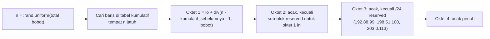

Bug v0.15.0: baris `{256, 170, 171}` tidak ada, sehingga dua /8 publik tidak pernah terpilih. Test regresinya
mengambil 60.000 sampel dengan seed tetap dan memastikan setiap oktet pertama yang valid muncul.

Pengecualian di oktet ketiga sedikit melanggar keseragaman sempurna (1/256 dari satu /16), dan ini diterima.

### 10.2 IPv6 terkompresi (RFC 5952)

`compress_ipv6_groups/1` adalah fungsi murni atas list 8 integer, dipisah agar bisa dites dengan input tetap
(peluang dua grup nol berurutan dari undian acak sangat kecil):

1. Cari run nol terpanjang. Kalau seri, ambil yang paling awal.
2. Kompres hanya kalau panjangnya 2 atau lebih (satu grup nol tetap ditulis `0`).
3. Tulis tanpa leading zero.

`[1, 0, 0, 0, 2, 3, 4, 5]` menjadi `"1::2:3:4:5"`; `[0, 1, 0, 2, 0, 3, 4, 5]` tetap `"0:1:0:2:0:3:4:5"`.

### 10.3 UUID v4

128 bit acak, lalu 6 bit ditimpa sesuai RFC 9562:

| Bit | Isi |
| --- | --- |
| 0-47 | Acak (`a`) |
| 48-51 | Versi, `0100` (4) |
| 52-63 | Acak (`b`) |
| 64-65 | Varian, `10` |
| 66-127 | Acak (`c`) |

```elixir
<<a::48, _version::4, b::12, _variant::2, c::62>> = :rand.bytes(16)
Base.encode16(<<a::48, 4::4, b::12, 2::2, c::62>>, case: letter_case)
```

Karena itu karakter ke-13 selalu `4` dan karakter ke-17 selalu salah satu dari `8`, `9`, `a`, `b`. Test memeriksa
kedua posisi ini.

### 10.4 Person: jenis kelamin dan prefix

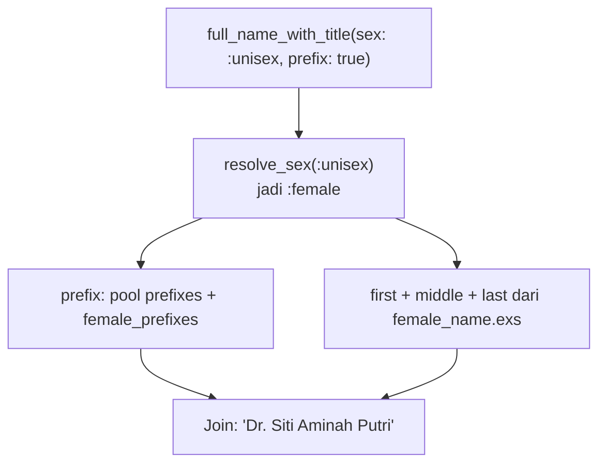

- `resolve_sex/1` dipanggil **sekali**, lalu hasilnya dipakai untuk semua bagian nama dan prefix.
- `name_affixes.exs` punya empat key: `"prefixes"` (netral: Dr., Prof.), `"female_prefixes"` (Mrs., Ibu, Hj.),
  `"male_prefixes"` (Mr., Bapak, H.), dan `"suffixes"`.
- `Person.prefix(sex: :unisex)` mengundi dari ketiga pool prefix sekaligus, sehingga perilaku lama
  (`prefix/0` mengembalikan prefix apa saja) tetap sama.

### 10.5 Lorem

Sumber teks disimpan sebagai satu string panjang per file. Generator memprosesnya sekali per locale:

1. Gabungkan baris yang terpotong (`\n` tunggal) menjadi spasi.
2. Split paragraf pada baris kosong (`\n\n`).
3. Split kalimat setelah `.`, `!`, atau `?` yang diikuti spasi.
4. Buang fragmen kosong, agar `Enum.random/1` tidak pernah mendapat list kosong.

`sentence/1` memilih paragraf acak lalu kalimat acak di dalamnya. Akibatnya kalimat dari paragraf pendek sedikit
lebih mungkin terpilih. Perilaku ini dipertahankan dari versi lama.

### 10.6 Time: presisi mikrodetik

```elixir
unit = if whole_second?(start) and whole_second?(finish), do: :second, else: :microsecond
Time.add(start, Enum.random(0..Time.diff(finish, start, unit)), unit)
```

Kalau kedua batas berpresisi detik, undian dalam detik dan hasilnya tetap berpresisi detik (`~T[10:00:00]`, bukan
`~T[10:00:00.000000]`). Kalau salah satu punya pecahan detik, undian dalam mikrodetik sehingga tidak pernah
melewati batas. Bug lama: offset dihitung dalam detik dari `10:00:00.9` ke `10:00:01.1`, lalu `+1 detik`
menghasilkan `10:00:01.9`, di luar batas.

### 10.7 Number: interpolasi tanpa overflow

```elixir
u = :rand.uniform()
min * (1 - u) + max * u
```

Rumus umum `min + u * (max - min)` gagal untuk `-1.0e308..1.0e308`, karena `max - min` melebihi float terbesar
dan BEAM melempar `ArithmeticError` (BEAM tidak punya `Infinity`). Bentuk interpolasi di atas tidak pernah
menghitung selisihnya.

### 10.8 Gravatar

- **Email** di-trim dan di-downcase dulu, baru dicocokkan dengan regex yang di-anchor `\A...\z`. Regex lama tanpa
  `^` menerima `"teks a@b.com"`.
- **URL** dibangun dengan `URI.encode_query/1`, sehingga fallback `https://x.io/a.png?b=1&c=2` di-encode
  menjadi satu nilai `d`, bukan memecah query.
- **Konstanta** (tipe fallback, rentang ukuran) dimiliki `NeoFaker.Gravatar` dan dioper ke validator sebagai
  argumen `{:custom, Validator, :validate_fallback, [@fallback_types]}`, jadi tidak ada salinan ganda.

### 10.9 NIK dan NPWP

```text
3273 01  490395  0042
│    │   │       └─ serial 0001-9999
│    │   └─ DDMMYY lahir; hari +40 untuk perempuan (49 = tanggal 9)
│    └─ kecamatan (01 = Sukasari)
└─ provinsi 32 (Jawa Barat) + kab/kota 73 (Kota Bandung)
```

- Enam digit pertama diambil dari 7.285 kode kecamatan resmi (Kepmendagri No. 300.2.2-2430 Tahun 2025) di
  `priv/data/id_id/person/region_code.exs`. File itu dibuat dari `db/wilayah.sql` di repositori
  [cahyadsn/wilayah](https://github.com/cahyadsn/wilayah) (MIT). Header atribusinya wajib dipertahankan.
- Usia 18 sampai 90 tahun dari hari ini (UTC).
- NPWP orang pribadi sama dengan NIK sejak UU HPP (UU No. 7 Tahun 2021), jadi `npwp/0` memanggil `nik/0`.

### 10.10 SSN

Format `AAA-GG-SSSS` dengan aturan SSA: area bukan `000`, `666`, atau `900`-`999`; grup bukan `00`; serial
bukan `0000`. Area diundi dari 898 nilai valid, lalu nilai `>= 666` digeser satu, sehingga setiap area punya
peluang yang sama.

### 10.11 Slugify

`Helpers.Formatter.slugify/1` dipakai untuk username, label domain, dan slug:

```elixir
string
|> :unicode.characters_to_nfd_binary()  # "José" jadi "Jose" + tanda aksen terpisah
|> String.downcase()
|> String.replace(~r/[^a-z0-9]/, "")     # buang aksen, tanda hubung, apostrof, spasi
```

Normalisasi NFD memisahkan huruf dasar dari tanda diakritiknya, jadi `"José"` menjadi `"jose"`, bukan `"jos"`.

---

## 11. Pipeline dokumentasi

### 11.1 Sumber kebenaran

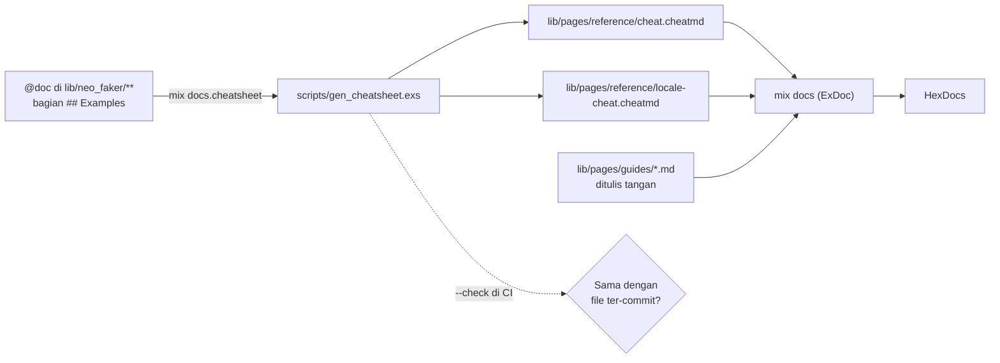

Generator cheatsheet:

1. Mengambil daftar modul dari `Application.spec(:neo_faker, :modules)`.
2. Membuang modul `@moduledoc false`, `NeoFaker`, dan `NeoFaker.Locale`.
3. Membagi `NeoFaker.Locales.*` ke locale-cheatsheet (dikelompokkan per kode locale, judulnya dari
   `@locale_names`) dan sisanya ke cheatsheet utama.
4. Untuk setiap fungsi, mengambil signature dan bagian `## Examples` dari `Code.fetch_docs/1`, diurutkan sesuai
   baris di file sumber.

Alias di `mix.exs`:

```elixir
"docs.cheatsheet": "run scripts/gen_cheatsheet.exs",
docs: ["docs.cheatsheet", "docs"]
```

### 11.2 Kenapa doctest tidak dipakai

Setiap fungsi punya `## Examples` dengan `iex>`, tetapi hasilnya acak, jadi tidak ada `doctest` di test. Contoh
di `@doc` karenanya bisa basi tanpa ketahuan. Aturan penggantinya: contoh harus berupa nilai yang **mungkin**
dikembalikan fungsi (bukan `"josé"` untuk username yang selalu ASCII, bukan NIK dengan kode kecamatan fiktif).

### 11.3 Nol warning ExDoc

Changelog menyebut fungsi sesuai keadaan di setiap rilis, termasuk yang sudah dihapus atau disembunyikan. File
itu dikecualikan lewat `skip_undefined_reference_warnings_on: ["lib/pages/about/changelog.md"]`. Di halaman lain,
jangan menulis referensi ber-backtick ke modul `@moduledoc false` atau fungsi yang sudah dihapus.

---

## 12. Testing dan CI

### 12.1 Pola test

- **Struktur cermin.** `test/neo_faker/<domain>_test.exs` untuk setiap `lib/neo_faker/<domain>.ex`, termasuk
  `test/neo_faker/locales/<kode>/`.
- **Nilai dari data sungguhan.** Test mengambil list lengkap lewat `Data.fetch!/3`, lalu memastikan hasil
  generator ada di dalamnya, alih-alih mencocokkan string tetap.
- **Undian berulang.** Properti distribusi dites dengan loop (`for _ <- 1..50`), atau dengan seed tetap dan
  sampel besar untuk kasus langka (IPv4, SSN).
- **Fungsi murni dipisah agar bisa dites deterministik.** Contoh: `compress_ipv6_groups/1`,
  `pick_public_third_octet/2`, `Lorem.Generator.split_paragraphs/1`.
- **`opaque/1`.** Beberapa test memanggil `Enum.random([nilai])` untuk "menyembunyikan" tipe dari type checker
  compiler, agar bisa mengirim input yang salah ke guard clause tanpa warning saat kompilasi.
- **Test yang menyentuh `Application` env** ada di `locale_application_env_test.exs` dengan `async: false`, karena
  config bersifat global untuk node.

### 12.2 CI

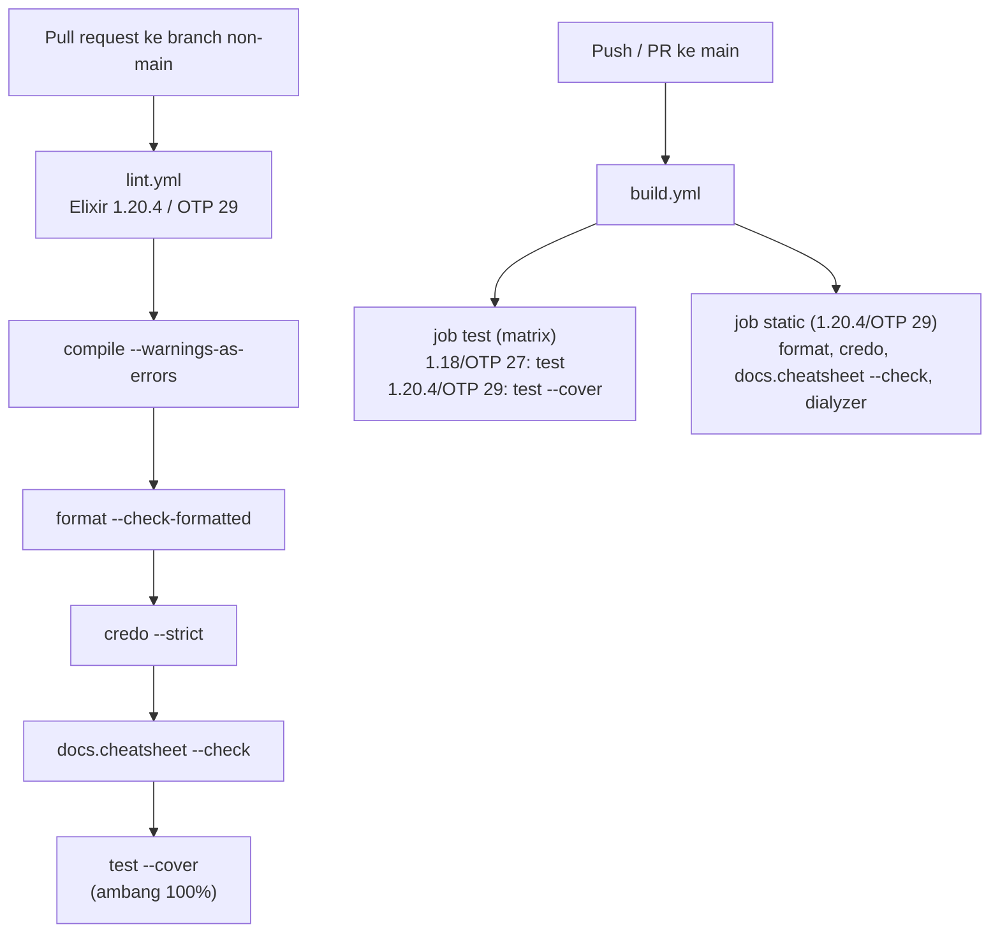

Semua langkah berjalan dengan `MIX_ENV=test`, sehingga satu cache `deps`/`_build` dipakai bersama.

Coverage 100% ditegakkan oleh `test_coverage: [summary: [threshold: 100]]` di `mix.exs`: `mix test --cover` keluar
dengan status non-nol kalau coverage di bawah itu. Di `build.yml`, hanya entri toolchain terbaru yang menjalankan
`--cover`, supaya perbedaan cara compiler lama menghitung baris tidak bisa menggagalkan build. Action yang dipakai:
`actions/checkout@v7`, `actions/cache@v6`, dan `erlef/setup-beam@v1`.

---

## 13. Keputusan desain dan trade-off

| Keputusan | Alternatif yang ditolak | Alasan |
| --- | --- | --- |
| Tanpa proses (fungsi murni + `:persistent_term`) | GenServer yang memegang data | Tidak ada bottleneck, tidak perlu supervision, baca tanpa copy |
| Locale di process dictionary | `Application.put_env` | Aman untuk `async: true`; config tetap jadi default node |
| Locale tak dikenal = error | Fallback diam ke `:default` | Typo harus terlihat; fallback hanya untuk *file* yang belum diterjemahkan |
| Data sebagai `.exs` di-eval | JSON, atau modul Elixir yang dikompilasi | Tanpa dependensi JSON; mudah diedit kontributor; aman karena path dibatasi |
| Cache per locale yang diminta | Cache per locale hasil fallback | Tanpa `File.exists?` di jalur panas; harga: data tersimpan ganda |
| Pool dengan `Enum.uniq` | `Map.values \|> List.flatten` | Nilai yang muncul di beberapa kategori tidak jadi lebih sering |
| Hash dan UUID dari `:rand` | `:crypto.strong_rand_bytes` | Ikut `seed/1`; ini data palsu |
| `token/2` tetap `:crypto` | `:rand` | Mencegah pengguna tak sengaja membuat token lemah |
| NimbleOptions untuk opsi | Validasi manual dengan `Keyword.get` | Error seragam, default terdokumentasi, key tak dikenal ditolak |
| `ArgumentError` untuk argumen posisional | `FunctionClauseError` dari guard | Pesan menyebut nama argumen dan nilainya |
| Cheatsheet di-generate | Ditulis tangan | Tidak bisa basi; dicek CI |
| `NeoFaker.start/0` tanpa output | `IO.puts` locale aktif | Library tidak boleh menulis ke stdout |

---

## 14. Batasan yang diketahui

- **Tidak ada jaminan keunikan.** Lihat [2.3](#23-non-goals).
- **Distribusi seragam, bukan realistis.** Nama langka sama mungkinnya dengan nama umum.
- **Locale tidak diwarisi proses anak.** Lihat [6.2](#62-kenapa-process-dictionary).
- **Seed tidak stabil lintas versi.** Perubahan data atau urutan undian mengubah output untuk seed yang sama.
- **Kode kecamatan NIK statis.** Pemekaran setelah Kepmendagri 2025 belum masuk sampai file data dibuat ulang.
- **Signature di cheatsheet bergantung versi compiler.** Kalau Elixir 1.20 menulis signature default argument
  berbeda dari 1.18, `docs.cheatsheet --check` di CI bisa gagal. Solusinya jalankan `mix docs.cheatsheet` di
  toolchain `mise.toml`, lalu commit.
- **Data tersimpan ganda untuk locale yang fallback.** Lihat [7.4](#74-kunci-cache).

---

## 15. Resep: menambah fitur

### 15.1 Fungsi baru di domain yang sudah ada

1. Tulis logika acak di `lib/neo_faker/<domain>/generator.ex` (atau `*Generator` yang sesuai).
2. Di modul domain: skema NimbleOptions di module attribute, `@doc` dengan gaya stdlib, `@spec`, dan
   `## Examples` dengan nilai yang mungkin dikembalikan.
3. Validasi argumen posisional dengan `Helpers.Validator` atau `Domain.Validator`.
4. Kalau membaca data: `Data.random_value/4` dengan modul domain (bukan `__MODULE__` generator) dan opsi
   `locale:`. Untuk beberapa kategori, pakai list key.
5. Test di `test/neo_faker/<domain>_test.exs`, termasuk cabang error.
6. `mix docs.cheatsheet`, lalu `mix test --cover` (harus tetap 100%).

### 15.2 Locale baru

1. Tambahkan kode ke `@supported_locales` di `lib/neo_faker/locale.ex`.
2. Buat `priv/data/<kode>/<domain>/<file>.exs` hanya untuk file yang diterjemahkan. Setiap file harus punya
   **semua** key milik file `default` yang sama, karena file locale menggantikan file default secara utuh.
3. Kalau ada modul locale-exclusive, tambahkan judul bagian di `@locale_names` dalam `scripts/gen_cheatsheet.exs`.
4. Perbarui tabel di `lib/pages/guides/locales.md`.

Panduan lengkap untuk kontributor ada di `lib/pages/contributing/adding-a-locale.md`.

### 15.3 Memperbarui kode kecamatan NIK

Buat ulang `priv/data/id_id/person/region_code.exs` dari `db/wilayah.sql` versi terbaru di cahyadsn/wilayah:
ambil semua kode berbentuk `XX.XX.XX`, hapus titiknya, urutkan, lalu pertahankan header sumber dan lisensi.
Test memastikan semua kode 6 digit dan 38 provinsi tercakup; angka 38 perlu disesuaikan kalau ada provinsi baru.

---

## 16. Peta file

Urutan baca yang disarankan untuk memahami kode dari nol:

| Urutan | File | Yang dipelajari |
| --- | --- | --- |
| 1 | `lib/neo_faker/locale.ex` | Resolusi locale dan validasinya |
| 2 | `lib/neo_faker/data.ex` | Load, cache, pool, `derive!/5` |
| 3 | `lib/neo_faker/address.ex` | Modul domain paling sederhana |
| 4 | `lib/neo_faker/person.ex` + `person/name_generator.ex` | Opsi `:sex`, pool prefix |
| 5 | `lib/neo_faker/internet.ex` + `internet/*.ex` | Fungsi komposit, penerusan opsi, IPv4 |
| 6 | `lib/neo_faker/helpers/*.ex` | Validasi dan formatting bersama |
| 7 | `lib/neo_faker/lorem/generator.ex` | Contoh `derive!/5` |
| 8 | `lib/neo_faker/locales/id_id/person*` | Modul locale-exclusive dengan data |
| 9 | `scripts/gen_cheatsheet.exs` | Pipeline dokumentasi |
| 10 | `test/neo_faker/data_test.exs` | Kontrak lapisan data |

Dokumen terkait:

| File | Untuk |
| --- | --- |
| `CLAUDE.md` | Aturan kerja ringkas untuk AI assistant (dan manusia) |
| `lib/pages/about/changelog.md` | Riwayat perubahan per versi |
| `lib/pages/guides/*.md` | Dokumentasi pengguna |
| `lib/pages/contributing/adding-a-locale.md` | Panduan kontributor locale |

---

## 17. Glosarium

| Istilah | Arti di NeoFaker |
| --- | --- |
| **Modul domain** | Modul API publik per topik, misalnya `NeoFaker.Person` |
| **Generator** | Submodul `@moduledoc false` berisi logika acak |
| **Locale-exclusive** | Modul di `NeoFaker.Locales.*` untuk format yang hanya ada di satu negara |
| **`:default`** | Data set dasar (bahasa Inggris AS); bukan kode locale |
| **Fallback** | Membaca file `:default` ketika locale yang didukung tidak punya file itu |
| **Pool** | Gabungan beberapa list dalam satu file data, tanpa duplikat |
| **Derived value** | Hasil olahan data file yang di-cache dengan `derive!/5` |
| **Jalur panas (hot path)** | Kode yang dijalankan di setiap panggilan, setelah cache terisi |
| **Global GC** | Scan heap semua proses yang dipicu ketika sebuah `persistent_term` diubah atau dihapus |
| **Rejection sampling** | Mengundi ulang ketika hasil jatuh di himpunan terlarang |
| **NFD** | Normalisasi Unicode yang memisahkan huruf dasar dari tanda diakritiknya |
